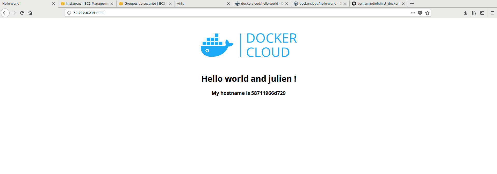

# First_docker
Après avoir ajoutée l'application `dockercloud/hello-world` et installé docker sur le serveur (instance EC2), nous avons modifié les fichiers `docker-cloud.yml` et `docker-compose.yml` pour binder le port 8080 sur le port 80, *cf ci dessous*.

	`ports:
	    - "8080:80"`
  
On a ensuite build l'application à l'aide de `docker-compose up`. Nous obtenons alors le résultat suivant :  


IDE utilisé: Atom avec plusieurs plugins d'installés :
 - nba-scoreboard (pour suivre en direct l'actualité du basketball)
 - atom-discord (pour discuter en direct avec ses coéquipiers de last project) 
 - java-plus (pour améliorer le dev java)
 - autocomplete-java (pour l'autocomp java)
 - java-class-complete (pour la generation de code)
 - php-cs-fixer (vérifie partiellement le code ... parceque oui encore des gens utilisent php...)

Shell utilisé : ZSH - Oh-My-Zs, voir ```.zshrc``` présent dans le git. 2 plugins instalés : docker et autocompletion

