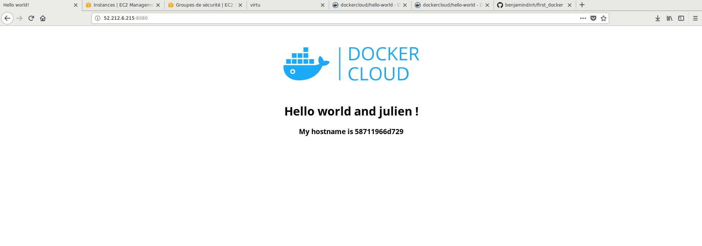

Après avoir ajoutée l'application `dockercloud/hello-world` et installé docker sur le serveur (instance EC2), nous avons modifié les fichiers `docker-cloud.yml` et `docker-compose.yml` pour binder le port 8080 sur le port 80, *cf ci dessous*.

	`ports:
	    - "8080:80"`
  
On a ensuite build l'application à l'aide de `docker-compose up`. Nous obtenons alors le résultat suivant :  

hello-world
===========

Sample docker image to test docker deployments

## Running locally

Build and run using Docker Compose:

	$ git clone https://github.com/docker/dockercloud-hello-world
	$ cd dockercloud-hello-world
	$ docker-compose up

## Deploying to Docker Cloud

[Install the Docker Cloud CLI](https://docs.docker.com/docker-cloud/tutorials/installing-cli/)

	$ docker login
	$ docker-cloud stack up

Hello world!

## Configuration

|Environment Variable|Default|Description|
|:-----:|:-----:|:----------|
|LISTEN_PORT|80|Set the Listen Port to access the hello-world container if it has the same Service Port.
